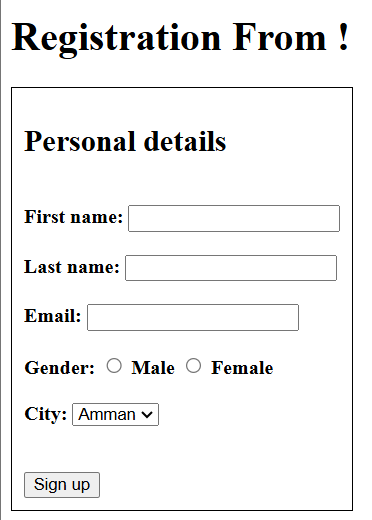
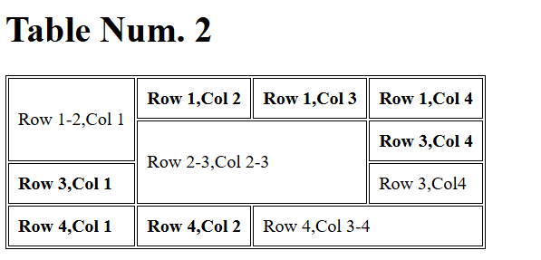
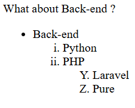

# Second-Task

# HTML 

### This task involves creating HTML pages for each provided image .

### I've created three  HTML images.
#### Here are some of them:

 ##### img1 :

 ##### img2 :

 ##### img3:
